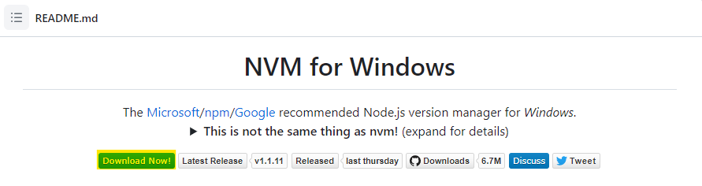
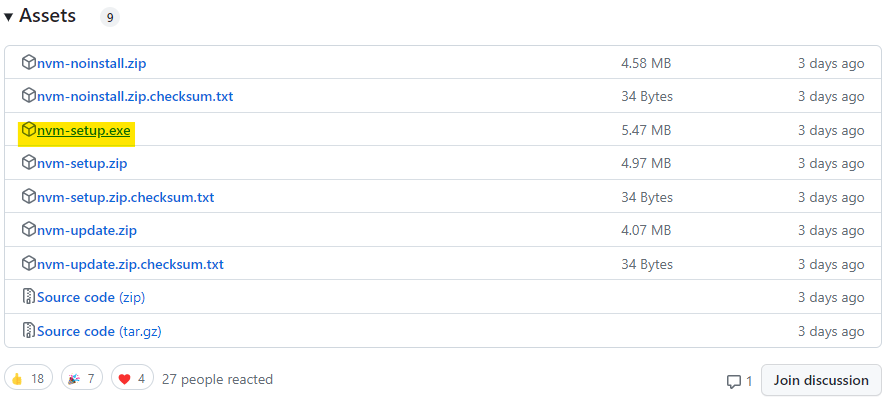

---

# 🪟 Window에서 Node.js 버전 손쉽게 변경하기

> 💡 Web 작업을 하다 보면 자연스럽게 Node.js라는 걸 접하게 된다.

---

## 📌 Node.js란?

Node.js는 **Chrome V8 JavaScript 엔진으로 빌드된 JavaScript 런타임**이다.

> 쉽게 말하면, **JavaScript를 브라우저가 아닌 서버에서도 사용할 수 있게 만든 프로그램**이다.

---

## ❓ 왜 Node 버전을 바꿔야 할까?

Node.js는 시간이 흐르며 여러 버전이 계속해서 출시되고 있다.

```
🗣️ 그냥 최신 버전 쓰면 되는 거 아닌가요?
```

> 물론 그렇게 써도 된다.  
> 하지만…

- **구형 프로젝트**를 유지보수하려면 **예전 버전의 Node**가 필요한 경우가 많다.
- 어떤 **라이브러리나 프레임워크는 특정 Node 버전만** 지원한다.
- 그때마다 삭제하고 재설치하는 방식은 **비효율적이고 번거롭다.**

그래서 등장한 도구가 있다.

---

## 🔧 NVM (Node Version Manager)

> Node.js의 버전을 손쉽게 **설치하고, 바꾸고, 삭제**할 수 있도록 도와주는 도구이다.

### 👉 설치 링크  
[https://github.com/coreybutler/nvm-windows](https://github.com/coreybutler/nvm-windows)



해당 페이지에서 형광색으로 표시된 `nvm-setup.exe` 파일만 설치하면 된다.



설치는 별다른 설정 없이 `Next`만 누르면 완료된다.  
설치가 끝난 뒤 아래 명령어를 입력하여 정상적으로 설치되었는지 확인한다:

```bash
nvm -v
# 또는
nvm version
```

> 📌 CMD는 **관리자 권한**으로 실행해야 한다.

---

## 🚀 NVM 사용법 요약

### 📋 현재 설치된 Node.js 목록 확인
```bash
nvm list
```
- 현재 사용 중인 버전은 `*` 표시가 붙는다.

---

### 🌐 설치 가능한 Node 버전 목록 확인
```bash
nvm list available
```

---

### ⬇️ Node.js 버전 설치
```bash
nvm install <버전>
# 예: nvm install 18.16.0
```

---

### 🔄 Node.js 버전 변경
```bash
nvm use <버전>
# 예: nvm use 18.16.0
```

버전을 변경한 뒤에는 `nvm list`로 적용이 잘 되었는지 확인한다.

---

## ⚠️ 경로 문제 발생 시

> npx나 npm이 정상적으로 작동하지 않는다면, 아래 명령어로 NVM의 루트 경로를 확인한다:

```bash
nvm root
```

- 설치된 Node가 `nodejs`라는 폴더 안에 있지 않고, **루트 경로에 바로 위치**해 있어야 정상적으로 작동한다.

---

## 🎯 마무리

NVM은 다양한 프로젝트를 다룰 때,  
**시간을 절약하고 더 유연한 개발 환경을 만들 수 있게 도와주는 유용한 도구**다.

> ✔️ Node 버전도 이제는 프로답게 관리하자.

---
