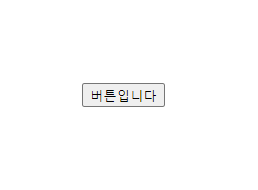
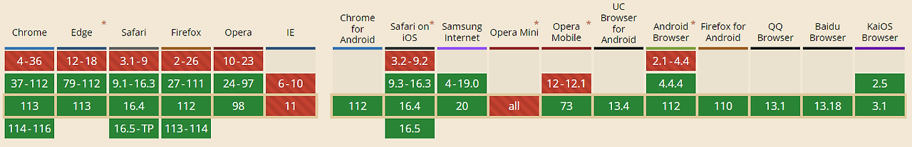

---

# 🧹 CSS 초기화? 이제는 `all: unset`으로 간단하게!

> 💡 HTML/CSS로 웹 페이지를 만들 때, 가장 먼저 해줘야 할 것 중 하나는 바로 **기본 스타일 초기화**.  
예전에는 `reset.css`를 사용했다면, **이제는 `all: unset` 하나면 충분하다!**

---

## 📌 왜 CSS 초기화가 필요할까?

> HTML 태그들은 브라우저마다 **기본 스타일**을 갖고 있다.  
예: `<button>` 태그에는 자동으로 **테두리, 배경색**이 지정되어 있음



---

### ✅ 문제점

→ 기본값이 내 디자인에 방해가 됨  
→ 브라우저마다 다르게 보일 수 있음  
→ 예상치 못한 스타일 깨짐 발생

---

## 🛠️ 옛날 방식: reset.css

```css
button {
  border: 0;
  background: none;
}
a {
  text-decoration: none;
  color: inherit;
}
/* …모든 태그를 일일이 초기화 */
```

> 💬 이렇게 하나하나 작성하는 게 귀찮고 길다!  
그래서 나온 해결책이 바로 **`all: unset`** 🎉

---

## ✨ 요즘 방식: `all: unset`

```css
button {
  all: unset;
}
```

> ✔️ 단 한 줄로!  
→ `border`, `background`, `padding`, `font` 등등…  
→ 거의 **모든 기본 스타일을 제거**해줌

---

## 📉 사용이 망설여졌던 이유?

- 예전에는 **Internet Explorer(IE)**에서 `all: unset`을 지원하지 않았음
- 그래서 프로젝트에서 사용하기가 애매했음

---

## ✅ 하지만 이제는?

> **IE가 공식적으로 종료되었고**,  
→ modern 브라우저들은 대부분 `all: unset`을 **완벽히 지원**함

<br>
📊 확인: [Can I use `all: unset`](https://caniuse.com/?search=all%3A%20unset)  
→ IE/Opera Mini 제외하면 전부 OK!

---

## 🧾 정리하자면?

```
Q. 왜 reset.css를 쓰던 걸 안 써도 되나요?
A. 이제 all: unset 한 줄이면 대부분 초기화가 되기 때문이에요.

Q. 진짜 괜찮아요? 모든 브라우저에서 되나요?
A. IE는 이제 안 써도 되니, 대부분의 브라우저에서는 잘 작동해요.

Q. 그럼 모든 태그에 all: unset 써도 되나요?
A. 상황에 따라 유연하게 사용하세요! 꼭 필요한 요소에만 적용해도 충분해요.
```

---

## 📎 문서참조

- [MDN: all - CSS](https://developer.mozilla.org/ko/docs/Web/CSS/all)  
- [Can I use all: unset](https://caniuse.com/?search=all%3A%20unset)

---
